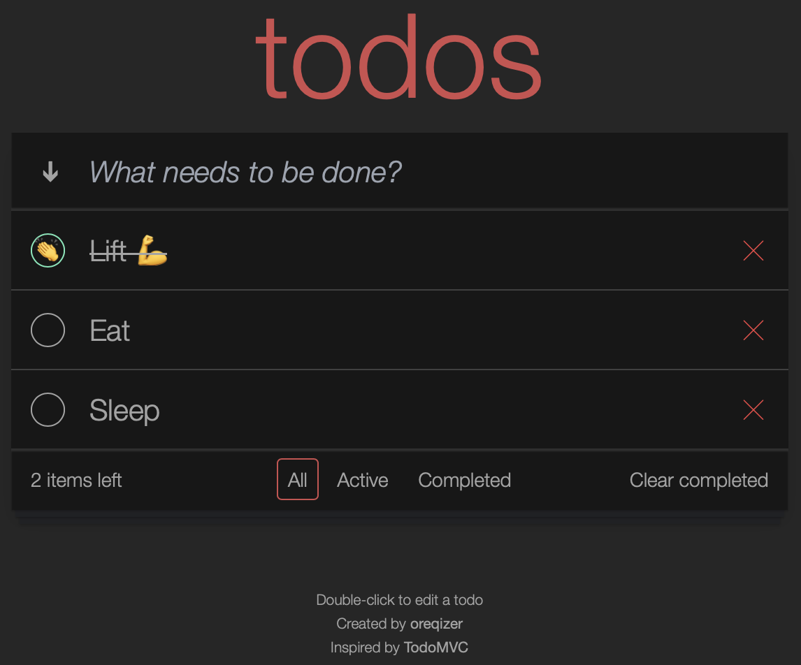

# todo spec

A demo TODO app with a filesystem database. :scroll: For demonstrating testing. Has dark mode!

Based on **TodoMVC**, except I changed the design a little so it is actually visible.

Before running, create a `db.json` file at the root of the project with `[]` as its content.

## Tests

The meat-and-potatoes of this project are its tests. There are **five** types of tests used:

- **UI tests** that verify the application works according to its specification
- **Layout visual tests** that make sure the app is composed as it should
- **Accessibility tests** that check the app is accessible
- **Unit tests** that verify core business logic of the app
- **Component visual tests** that make sure individual components look as they should

## License

MIT
